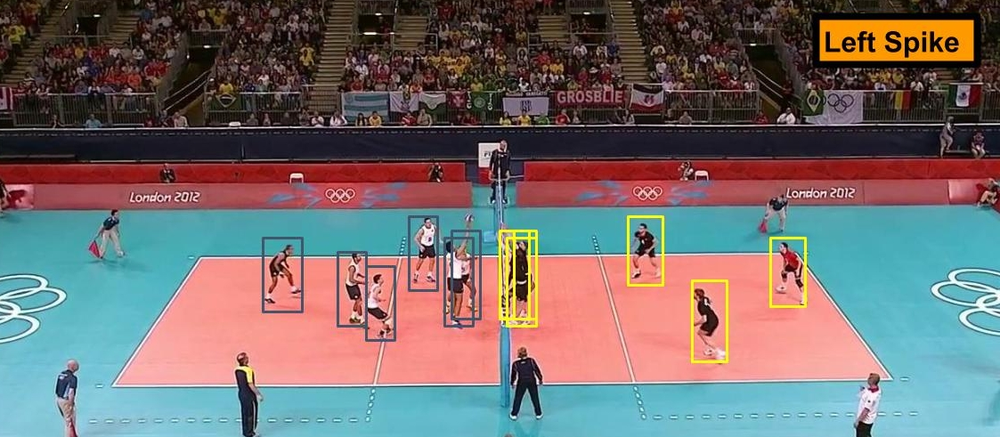
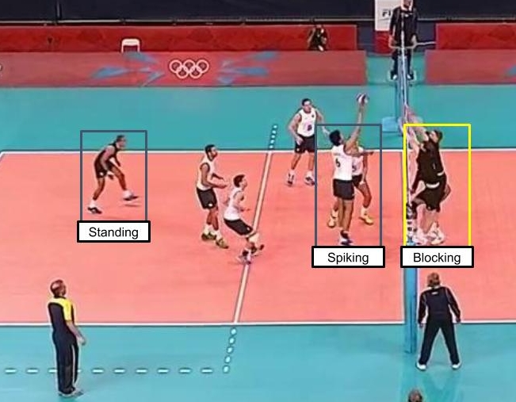

# 📦 Dataset

## Overview

The dataset is built from publicly available YouTube volleyball videos. It contains 4,830 annotated frames across 55 videos, with player actions labeled into **9 individual-level classes** and team activities into **8 group-level classes**.

> For a hands-on walkthrough of all dataset modes and visualizations, see [`hrn_gar_preparedata.ipynb`](DataSet/hrn-gar-preparedata.ipynb).

---

## Example Annotation

*Figure: A frame labeled as "Left Spike," with bounding boxes around each player.*

*Figure: For each visible player, an action label is annotaed.*

---

## Train / Test Split

| Split | Frames |
|-------|--------|
| Train | 3,493 |
| Test  | 1,337 |

**Train videos:** 1, 3, 6, 7, 10, 13, 15, 16, 18, 22, 23, 31, 32, 36, 38, 39, 40, 41, 42, 48, 50, 52, 53, 54  
**Validation videos:** 0, 2, 8, 12, 17, 19, 24, 26, 27, 28, 30, 33, 46, 49, 51  
**Test videos:** 4, 5, 9, 11, 14, 20, 21, 25, 29, 34, 35, 37, 43, 44, 45, 47

---

## Label Statistics

**Group Activity** (one label per clip)

| Class | Instances |
|-------|-----------|
| Right set | 644 |
| Right spike | 623 |
| Right pass | 801 |
| Right winpoint | 295 |
| Left winpoint | 367 |
| Left pass | 826 |
| Left spike | 642 |
| Left set | 633 |

**Player Action** (one label per player per frame)

| Class | Instances |
|-------|-----------|
| Waiting | 3,601 |
| Setting | 1,332 |
| Digging | 2,333 |
| Falling | 1,241 |
| Spiking | 1,216 |
| Blocking | 2,458 |
| Jumping | 341 |
| Moving | 5,121 |
| Standing | 38,696 |

> Note the heavy class imbalance in player actions — **Standing** dominates with ~69% of all instances. Class weights are computed automatically by the dataset classes and saved to disk for use during training.

---

## Dataset Classes

Two PyTorch `Dataset` classes handle all loading, cropping, and label preparation:

**`Person_Activity_DataSet`** — crops each player from a frame and returns a per-player action label. Supports single-frame mode (`seq=False`) and multi-frame sequence mode (`seq=True`).

**`Group_Activity_DataSet`** — same cropping logic but returns a single group-level label per clip. Adds an optional `sort=True` flag that orders players left-to-right by their x-centre, which is useful for spatially-aware models.

Both classes share the same collate functions (`person_collate_fn`, `group_collate_fn`) that pad variable player counts to a fixed `MAX_PLAYERS=12` and return consistently shaped tensors:

| Mode | Video tensor | Label tensor |
|------|-------------|--------------|
| Person, seq=False | `[B, 12, 3, H, W]` | `[B, 12]` |
| Person, seq=True | `[B, T, 12, 3, H, W]` | `[B, 12]` |
| Group, seq=False | `[B, 12, 3, H, W]` | `[B]` |
| Group, seq=True | `[B, T, 12, 3, H, W]` | `[B]` |

For further information about the dataset, see the [paper authors' repository](https://github.com/mostafa-saad/deep-activity-rec/tree/master).

---

python  main.py   --mode train   --model B1-NoRelations   --stage 1   --config configs/single_frame_configs/B1_NoRelations_stage1.yaml

