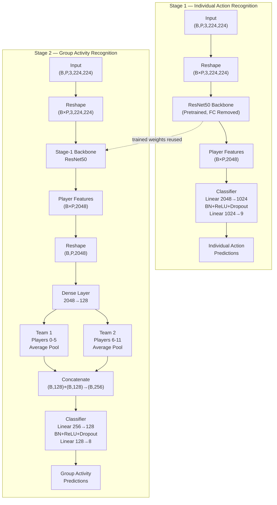
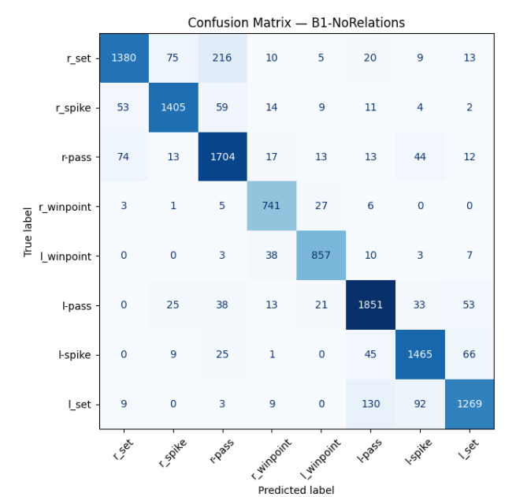
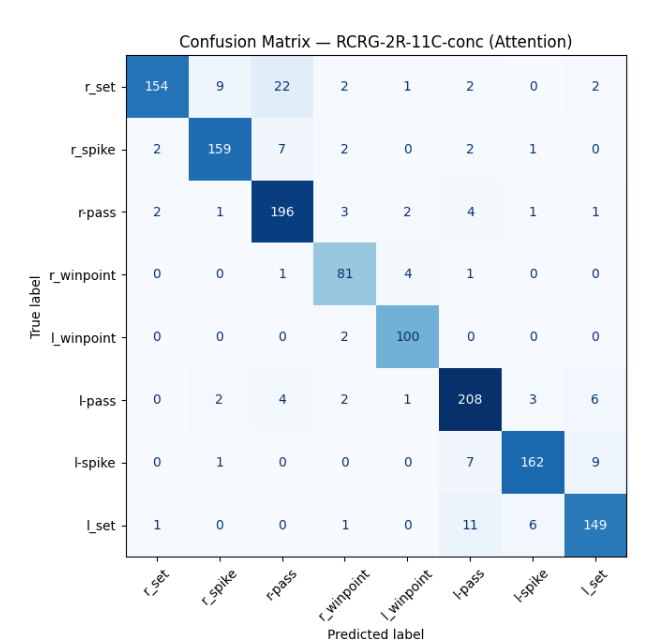

<h1 align="center">Relational-Group-Activity-Recognition</h1>

<p align="center">
  This repository provides an implementation of the <strong>ECCV 2018 paper</strong>, 
  <a href="https://openaccess.thecvf.com/content_ECCV_2018/papers/Mostafa_Ibrahim_Hierarchical_Relational_Networks_ECCV_2018_paper.pdf">
    <em>Hierarchical Relational Networks for Group Activity Recognition</em>
  </a>.  
  Unlike traditional pooling methods (max, average, or attention pooling) that reduce dimensionality but discard important spatial and relational details, this paper introduces a <strong>relational layer</strong>. 
  The relational layer enhances a person's representation by explicitly modeling interactions with its neighbors in a structured relationship graph, leading to richer scene-level understanding.
</p>

<p align="center">
  
  
  
</p>

---

## Table of Contents
1. [Key Updates](#key-updates)
2. [Introduction](#introduction)
   - [How the Relational Layer Works](#how-the-relational-layer-works)
   - [Architecture Overview](#architecture-overview)
3. [Usage](#usage)  
   - [Clone the Repository](#1-clone-the-repository)  
   - [Install Dependencies](#2-install-the-required-dependencies)  
4. [Model Evaluation Notebook](#model-evaluation-notebook)
5. [Dataset Overview](#dataset-overview)  
   - [Example Annotations](#example-annotations)  
   - [Train-Test Split](#train-test-split)  
   - [Dataset Statistics](#dataset-statistics)  
   - [Dataset Organization](#dataset-organization)  
   - [Dataset Download Instructions](#dataset-download-instructions)  
6. [Ablation Study](#ablation-study)  
   - [Single Frame Models](#single-frame-models)  
   - [Temporal Models](#temporal-models)  
   - [Attention Models (New Baseline)](#attention-models-new-baseline)
7. [Confusion Matrices — Final Test Set Evaluation](#confusion-matrices--final-test-set-evaluation)

---

## Key Updates

- **ResNet-50 Backbone**: Replaced VGG19 with ResNet-50 for stronger feature extraction.  
- **Ablation Studies**: Comprehensive experiments to evaluate the contribution of each model component.  
- **Improved Performance**: Achieves consistently higher accuracy across all baselines compared to the original paper.  
- **Modern Implementation**: Fully implemented in **PyTorch** with support from **PyTorch Geometric**.
- **Centralized Evaluation Notebook**: All best checkpoints for every baseline are pulled from a single Hugging Face model hub repository and evaluated end-to-end in one notebook (see [Model Evaluation Notebook](#model-evaluation-notebook)).

---

# Introduction

Traditional pooling methods (max, average, or attention pooling) reduce dimensionality but often discard important **spatial** and **relational** details between people. The **Hierarchical Relational Network (HRN)** addresses this by introducing a **relational layer** that explicitly models interactions between individuals in a **structured relationship graph**.

<p align="center">
  
</p>

## How the Relational Layer Works

1. **Graph Construction**  
   - Each person in a frame is represented as a node.  
   - People are ordered based on the top-left corner `(x, y)` of their bounding boxes (first by x, then by y if tied).  
   - Edges connect a person to their neighbors, forming **cliques** in the graph.  

2. **Initial Person Features**  
   Each person's initial representation comes from a CNN backbone (e.g., ResNet50):  

   $$P_i^0 = \text{CNN}(I_i)$$

   where $I_i$ is the cropped image around person $i$.  

3. **Relational Update**  

   <p align="center">
   
   </p>

   At relational layer $\ell$, person $i$'s updated representation is:  

   $$P_i^\ell = \sum_{j \in E_i^\ell} F^\ell(P_i^{\ell-1} \oplus P_j^{\ell-1}; \theta^\ell)$$

   - $E_i^\ell$: neighbors of person $i$ in graph $G^\ell$  
   - $\oplus$: concatenation operator  
   - $F^\ell$: shared MLP for layer $\ell$ (input size $2N_{\ell-1}$, output size $N_\ell$)  

   * This step computes pairwise relation vectors between $i$ and its neighbors, then aggregates them.  

4. **Hierarchical Stacking**  

   <p align="center">
   
   </p>
  
   - Multiple relational layers are stacked, compressing person features while refining relational context.  
   - The architecture supports a variable number of people $K$ (robust to occlusions or false detections).  

5. **Scene Representation**  
   The final scene feature $S$ is obtained by pooling person features from the last relational layer:  

   $$S = P_1^L \ ▽ \ P_2^L \ ▽ \dots \ ▽ \ P_K^L$$

   where $▽$ is a pooling operator (e.g., concatenation or element-wise max pooling).

## Architecture Overview

Each baseline in `networks/` (both `single_frame_nets` and `attention_net`) has an accompanying architecture diagram generated as a Mermaid graph. Below is a sample for the **B1-NoRelations** baseline — showing Stage 1 (individual action recognition, fine-tuning ResNet50) feeding into Stage 2 (group activity recognition):



> 📁 The full set of per-model Mermaid diagrams (`B1_NoRelations`, `RCRG_1R_1C`, `RCRG_2R_11C`, `RCRG_2R_11C_conc`, `RCRG_2R_21C`, `RCRG_2R_21C_conc`, `RCRG_3R_421C`, `RCRG_3R_421C_conc`, and the attention variants) live under `assets/networks/`.

-----

## Usage

---

### 1. Clone the Repository
```bash
git clone https://github.com/Sh-31/Relational-Group-Activity-Recognition.git
```

### 2. Install the Required Dependencies
```bash
pip install -r requirements.txt
```
-----

## Model Evaluation Notebook

All best checkpoints across **every baseline** (single-frame, temporal, and attention models) are consolidated into a single Hugging Face Hub repository — **[`AbdoSaad24/HRN-GAR-Best-Models`](https://huggingface.co/AbdoSaad24/HRN-GAR-Best-Models)** — and evaluated end-to-end in one place:

📓 **[`Outputs/hgar-evaluations.ipynb`](Outputs/hgar-evaluations.ipynb)**

In this notebook you will find:

- Automated download of every model's `best.pt` checkpoint from its original Hugging Face repo, re-uploaded into the unified `HRN-GAR-Best-Models` hub.
- A reusable `evaluate_confusion_matrix()` routine that loads any baseline, runs it on the held-out test split, and reports accuracy, F1, and a confusion matrix.
- A ready-to-run cell for **every model in the ablation study** — simply run the corresponding cell to reproduce that model's test-set results.
- The final confusion matrices shown in the [Confusion Matrices](#confusion-matrices--final-test-set-evaluation) section at the bottom of this README were generated directly from this notebook.

If you want to sanity-check or reproduce any number in the tables below, this notebook is the single source of truth.

-----

## Dataset Overview

The dataset was created using publicly available YouTube volleyball videos. The authors annotated 4,830 frames from 55 videos, categorizing player actions into 9 labels and team activities into 8 labels. 

### Example Annotations


- **Figure**: A frame labeled as "Left Spike," with bounding boxes around each player, demonstrating team activity annotations.


### Train-Test Split

- **Training Set**: 3,493 frames
- **Testing Set**: 1,337 frames

### Dataset Statistics

#### Group Activity Labels
| Group Activity Class | Instances |
|-----------------------|-----------|
| Right set            | 644       |
| Right spike          | 623       |
| Right pass           | 801       |
| Right winpoint       | 295       |
| Left winpoint        | 367       |
| Left pass            | 826       |
| Left spike           | 642       |
| Left set             | 633       |

#### Player Action Labels
| Action Class | Instances |
|--------------|-----------|
| Waiting      | 3,601     |
| Setting      | 1,332     |
| Digging      | 2,333     |
| Falling      | 1,241     |
| Spiking      | 1,216     |
| Blocking     | 2,458     |
| Jumping      | 341       |
| Moving       | 5,121     |
| Standing     | 38,696    |

### Dataset Organization

- **Videos**: 55, each assigned a unique ID (0–54).
- **Train Videos**: 1, 3, 6, 7, 10, 13, 15, 16, 18, 22, 23, 31, 32, 36, 38, 39, 40, 41, 42, 48, 50, 52, 53, 54.
- **Validation Videos**: 0, 2, 8, 12, 17, 19, 24, 26, 27, 28, 30, 33, 46, 49, 51.
- **Test Videos**: 4, 5, 9, 11, 14, 20, 21, 25, 29, 34, 35, 37, 43, 44, 45, 47.

### Dataset Download Instructions

1. Enable Kaggle's public API. Follow the guide here: [Kaggle API Documentation](https://www.kaggle.com/docs/api).  
2. Use the provided shell script:
```bash
  chmod 600 .kaggle/kaggle.json 
  chmod +x script/script_download_volleball_dataset.sh
  .script/script_download_volleball_dataset.sh
```
For further information about dataset, you can check out the paper author's repository:  
[link](https://github.com/mostafa-saad/deep-activity-rec)

---

## [Ablation Study](https://en.wikipedia.org/wiki/Ablation_(artificial_intelligence)#:~:text=In%20artificial%20intelligence%20(AI)%2C,resultant%20performance%20of%20the%20system)

### Baselines

#### Single Frame Models

- **B1-NoRelations:** In the first stage, ResNet50 is fine-tuned and a person is represented with 2048-d features. In the second stage, each person is connected to a shared dense layer of 128 features. The person representations (each of length 128 features) are then pooled and fed to a softmax layer for group activity classification.

- **RCRG-1R-1C:** Pretrained ResNet50 network is fine-tuned and a person is represented with 2048-d features, then a single relational layer (1R), all people in 1 clique (1C), so all-pairs relationships are learned.

- **RCRG-1R-1C-untuned:** Same as previous variant, but pretrained ResNet50 network without fine-tuning.

- **RCRG-2R-11C:** Close to the RCRG-1R-1C variant, but uses 2 relational layers (2R) of sizes 256 and 128. The graphs of these 2 layers are 1 clique (11C) of all people. This variant and the next ones explore stacking layers with different graph structures.

- **RCRG-2R-21C:** Same as the previous model, but the first layer has 2 cliques, one per team. The second layer is all-pairs relations (1C).

- **RCRG-3R-421C:** Three relational layers (of sizes 512, 256, and 128) with clique sizes of the layers set to (4, 2, 1). The first layer has 4 cliques, with each team divided into 2 cliques.

##### Performance Comparison

###### Original Paper Baselines Score


###### My Scores (Accuracy)

| Model | Test Acc  | Paper Test Acc |
| :---- | :---:  | :---: |
| B1-no-relations | 88.69% | 85.1% |
| RCRG-1R-1C | 88.90%  | 86.5% |
| RCRG-1R-1C-untuned | 79.72% | 75.4% |
| RCRG-2R-11C | 88.51% | 86.1% |
| RCRG-2R-21C | 89.15% | 87.2% |
| RCRG-3R-421C | 88.53% | 86.4% |
| RCRG-2R-11C-conc | 88.52% | 88.3% |
| **RCRG-2R-21C-conc**  | 89.00% | 86.7% |
| RCRG-3R-421C-conc  | 88.82% | 87.3% |

> Notes:
> - `-conc` postfix is used to indicate concatenation pooling instead of max-pooling.

---

#### Temporal Models

- **RCRG-2R-11C-conc-temporal:** Uses 2 relational layers (2R) of sizes 256 and 128. The graphs of these 2 layers are 1 clique (11C) of all people. 

- **RCRG-2R-21C:** The first layer has 2 cliques, one per team. The second layer is all-pairs relations (1C).

##### Performance Comparison

###### Original Paper Baselines Score


###### My Scores (Accuracy)

| Model | Test Acc | Paper Test Acc |
| :---- | :---: | :---: |
| RCRG-2R-11C-conc | 89.75% | 89.5% |
| RCRG-2R-21C | 89.68%  | 89.4% |

> Notes:
> - `Temporal` postfix indicates the model operates on a sequence of frames, not a single frame.
> - `-conc` postfix indicates concatenation pooling instead of max-pooling.
> - The original paper did not clearly specify where the LSTM unit should be integrated into the model. To explore this, three variants were implemented:
>   - `V1`: LSTM **before** the relational layer → allows the relational layer to learn richer spatio-temporal features.
>   - `V2`: LSTM **after** the relational layer → enhances the relational features with temporal modeling.
>   - `V3`: LSTMs **both before and after** the relational layer → combines the strengths of V1 and V2.
> - `RCRG-2R-11C-conc` was chosen for the full ablation since it achieved the best performance in both this implementation and the paper's results.
> - `B1-no-relations-temporal` was implemented to isolate the impact of the relational layer (not present in the original paper).

---

#### Attention Models (New Baseline)

- Uses 2 relational layers (2R). The graphs of these two layers are one clique (11C) of all players, but this time using a **graph attentional operator** instead of an MLP for the relational layers.

###### My Scores (Accuracy)

| Model | Test Acc | Paper Test Acc |
| :---- | :---: |  :---: |
| RCRG-2R-11C-conc-V1 (Attention)  | 90.43% | — |

---

## Confusion Matrices — Final Test Set Evaluation

The following confusion matrices were generated on the **held-out test split** using [`Outputs/hgar-evaluations.ipynb`](Outputs/hgar-evaluations.ipynb), loading checkpoints directly from [`AbdoSaad24/HRN-GAR-Best-Models`](https://huggingface.co/AbdoSaad24/HRN-GAR-Best-Models).

### B1-NoRelations

<p align="center">
  
</p>

### RCRG-2R-11C-conc (Attention, Best Model)

<p align="center">
  
</p>

-----